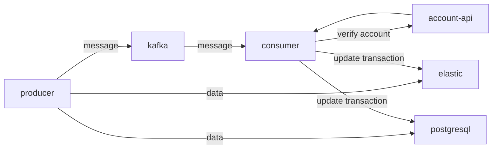

# Acesso-Bankly Architect Test
Hi! This application was developed as a test for **Acesso/Bankly** specialist architect position. Feel free to open new issues and suggest new features.

## Dependencies

Yeah, we took care about everything for you. You just need [Docker](https://www.docker.com/) installed on your machine.

## Running

Easy-peasy! Just run the following command and wait for applications to start.

    $ docker-compose up -d

## Endpoints

After applications start, you will be able to find the endpoints in [localhost](localhost:3333), port 3333.

## Architecture
Here's a simple diagram of how this application works. 

